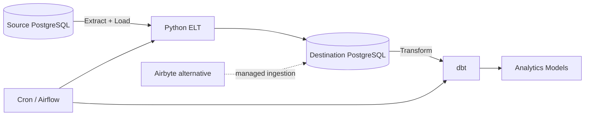

# Data Engineering Course — Hands-on ELT Project

A practical beginner-to-intermediate data engineering project built around the learning path from the freeCodeCamp / Justin Chau course:

**Video:** https://www.youtube.com/watch?v=PHsC_t0j1dU

The repository turns the course into something you can actually run, inspect, change, and explain in an interview.

## What you will learn

1. **Data Engineering fundamentals**
   - ETL vs ELT
   - source systems, warehouses, transformations, orchestration
   - batch pipelines and dependencies

2. **Docker + Docker Compose**
   - containers, images, networks, volumes
   - service-to-service communication
   - containerized PostgreSQL

3. **PostgreSQL**
   - source and destination databases
   - schemas and sample transactional data
   - validating loaded data

4. **Build an ELT pipeline**
   - wait for database readiness
   - extract with `pg_dump`
   - load with `psql`
   - fail fast when a pipeline step fails

5. **dbt**
   - staging models
   - marts
   - tests
   - lineage
   - transformation after loading

6. **Orchestration**
   - Cron for simple scheduling
   - Airflow DAG concepts
   - task dependencies and retries

7. **Airbyte**
   - where a managed connector layer fits
   - when to build vs buy ingestion

---

## Architecture



The central idea is **ELT**:

- **Extract** data from the source.
- **Load** raw data into the destination.
- **Transform** it inside the destination using dbt.

This separation is common in modern analytics engineering because the warehouse becomes the compute layer for transformations.

---

## Quick start

### Requirements

Install:

- Docker Desktop
- Docker Compose
- Git
- optional: Python 3.11+ and dbt-postgres for local dbt development

Clone:

```bash
git clone https://github.com/abed-dvp/data-engineering-course.git
cd data-engineering-course
```

Create your environment file:

```bash
cp .env.example .env
```

Start the source database, destination database, and ELT service:

```bash
docker compose up --build
```

The source PostgreSQL database is exposed on:

```text
localhost:5433
```

The destination PostgreSQL database is exposed on:

```text
localhost:5434
```

---

## Validate the pipeline

After the ELT container finishes, inspect the destination:

```bash
docker exec -it destination_postgres psql -U postgres -d destination_db
```

Then:

```sql
\dt

SELECT COUNT(*) FROM users;
SELECT COUNT(*) FROM orders;
```

If the counts match the source database, the Extract + Load part worked.

---

## Run dbt

The `dbt_project/` folder contains a small analytics transformation layer.

From a machine with `dbt-postgres` installed:

```bash
cd dbt_project
cp profiles.yml.example ~/.dbt/profiles.yml
dbt debug
dbt run
dbt test
```

The models demonstrate the usual dbt layering:

```text
raw source
   ↓
staging
   ↓
marts
```

Example mart:

- customer order count
- total revenue
- average order value

---

## ETL vs ELT

### ETL

```text
Extract → Transform → Load
```

Transformation happens before data reaches the destination.

### ELT

```text
Extract → Load → Transform
```

Raw data is loaded first. Transformation happens later in the warehouse.

This repository uses **ELT**.

---

## Why Docker matters

Without Docker, every learner may have a different PostgreSQL version, Python environment, port configuration, or operating-system setup.

Docker gives us reproducible services:

```yaml
source_postgres
destination_postgres
elt_script
```

All three services communicate through the same Docker network.

Inside Docker, the Python service does **not** connect to `localhost`.

It connects using service names:

```text
source_postgres
destination_postgres
```

That is one of the most important Docker networking concepts in this project.

---

## The ELT pipeline

The ELT script performs four important steps:

1. Wait for both PostgreSQL services.
2. Dump the source database with `pg_dump`.
3. Load the dump into the destination with `psql`.
4. Exit with an error if any required command fails.

Conceptually:

```python
wait_for_database()
extract()
load()
validate()
```

This is intentionally simple. Production data pipelines usually add:

- observability
- retries with backoff
- idempotency
- incremental loads
- schema evolution
- data quality checks
- secrets management
- alerting

---

## Scheduling: Cron vs Airflow

### Cron

Good when:

- one or a few jobs
- simple fixed schedule
- minimal dependencies

Example:

```cron
0 7 * * * /path/to/run_elt.sh
```

### Airflow

Better when:

- several dependent tasks
- retries matter
- you need task history and observability
- jobs form a DAG
- multiple pipelines must coordinate

The example DAG in this repository models:

```text
wait → ELT → dbt run → dbt test
```

---

## Where Airbyte fits

Our Python script is a **custom ingestion solution**.

Airbyte is an example of a connector-based ingestion platform.

A useful engineering trade-off:

| Custom code | Connector platform |
|---|---|
| Maximum control | Faster setup |
| You own maintenance | Connector maintenance is partly externalized |
| Easy to customize | Many sources already supported |
| More engineering effort | Less code for standard integrations |

For a common SaaS source, a connector may save substantial engineering time.

For specialized logic, custom ingestion may still be appropriate.

---

## Interactive Codelab

The repository also contains **Abed Codelab — Data Engineering**:

https://abed-dvp.github.io/data-engineering-course/

It includes:

- short explanations
- architecture mental models
- code examples
- Docker and SQL exercises
- ELT debugging scenarios
- dbt exercises
- orchestration exercises
- answer checking
- progress tracking
- light/dark mode

> GitHub Pages must be enabled once for this repository before the URL becomes live.

---

## Repository structure

```text
data-engineering-course/
├── README.md
├── .env.example
├── docker-compose.yml
├── source_db_init/
│   └── init.sql
├── elt_script/
│   ├── Dockerfile
│   └── elt_script.py
├── dbt_project/
│   ├── dbt_project.yml
│   ├── profiles.yml.example
│   └── models/
│       ├── sources.yml
│       ├── staging/
│       │   ├── stg_users.sql
│       │   ├── stg_orders.sql
│       │   └── schema.yml
│       └── marts/
│           ├── customer_revenue.sql
│           └── schema.yml
├── orchestration/
│   ├── cron/
│   │   └── run_elt.sh
│   └── airflow/
│       └── elt_dag.py
├── codelab/
│   ├── index.html
│   ├── styles.css
│   ├── steps.js
│   └── app.js
└── index.html
```

---

## Suggested study order

Do not try to memorize every tool.

Use this sequence:

1. Understand the architecture.
2. Start the containers.
3. inspect the source database.
4. Run the ELT pipeline.
5. inspect the destination.
6. run dbt.
7. understand scheduling.
8. compare Cron, Airflow, and Airbyte.
9. explain the complete pipeline without looking at the diagram.

If you can explain **why each component exists**, you understand much more than someone who only memorized commands.

---

## Interview-ready mental model

When asked to design a batch data pipeline, start with:

```text
Source → Ingestion → Raw storage → Transformation → Serving layer
                    ↑
              Orchestration
```

Then discuss:

- data volume
- batch vs streaming
- freshness requirements
- failure/retry strategy
- idempotency
- schema changes
- data quality
- observability
- security
- cost

That turns a tool-focused answer into an engineering answer.

---

## Credits

The learning sequence is based on the freeCodeCamp / Justin Chau beginner data engineering course and Justin Chau's public example repositories.

The explanations, sample dataset, exercises, dbt models, orchestration examples, and Codelab in this repository are independently written for hands-on study.
